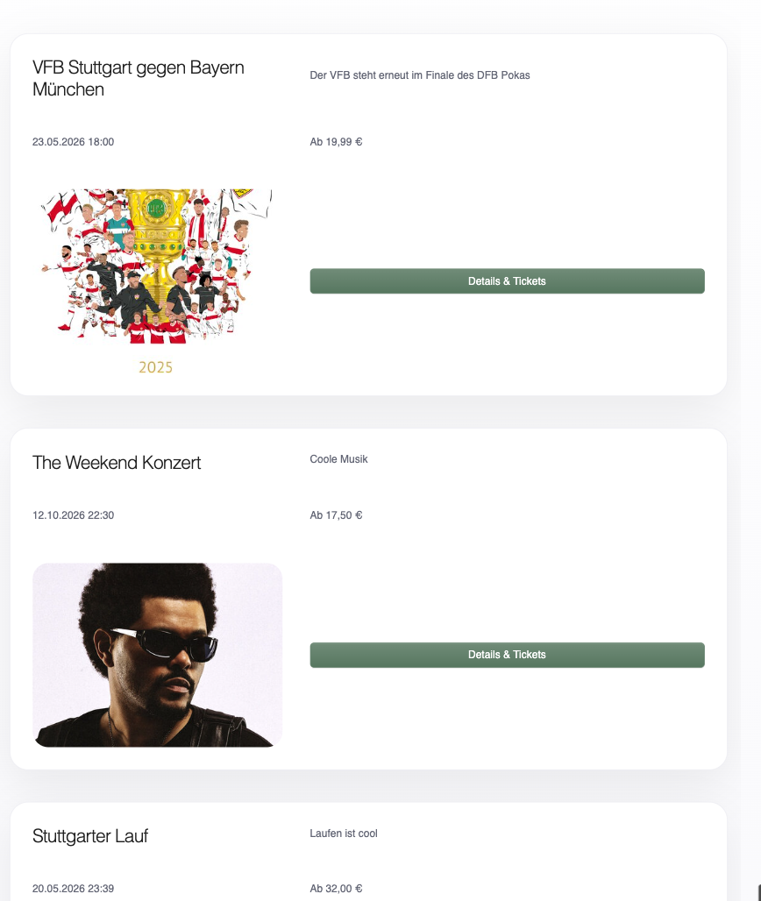
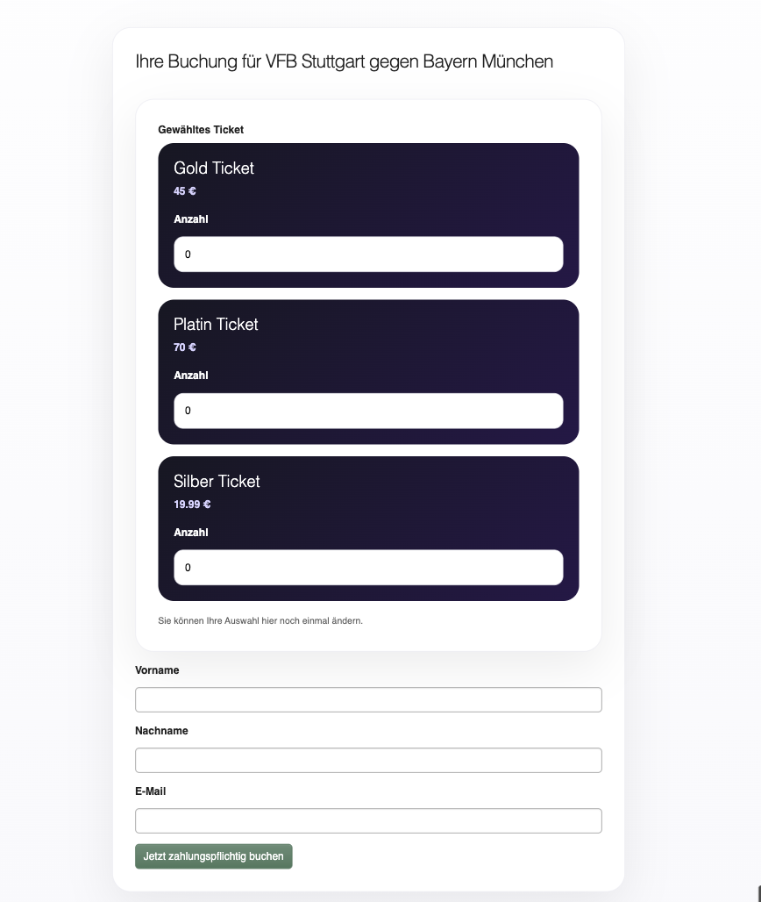
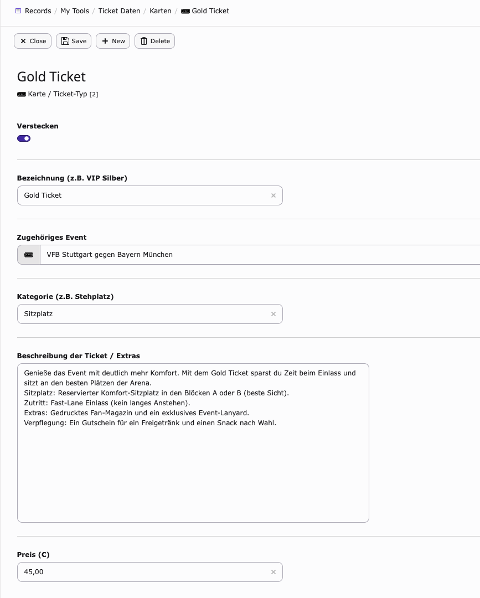
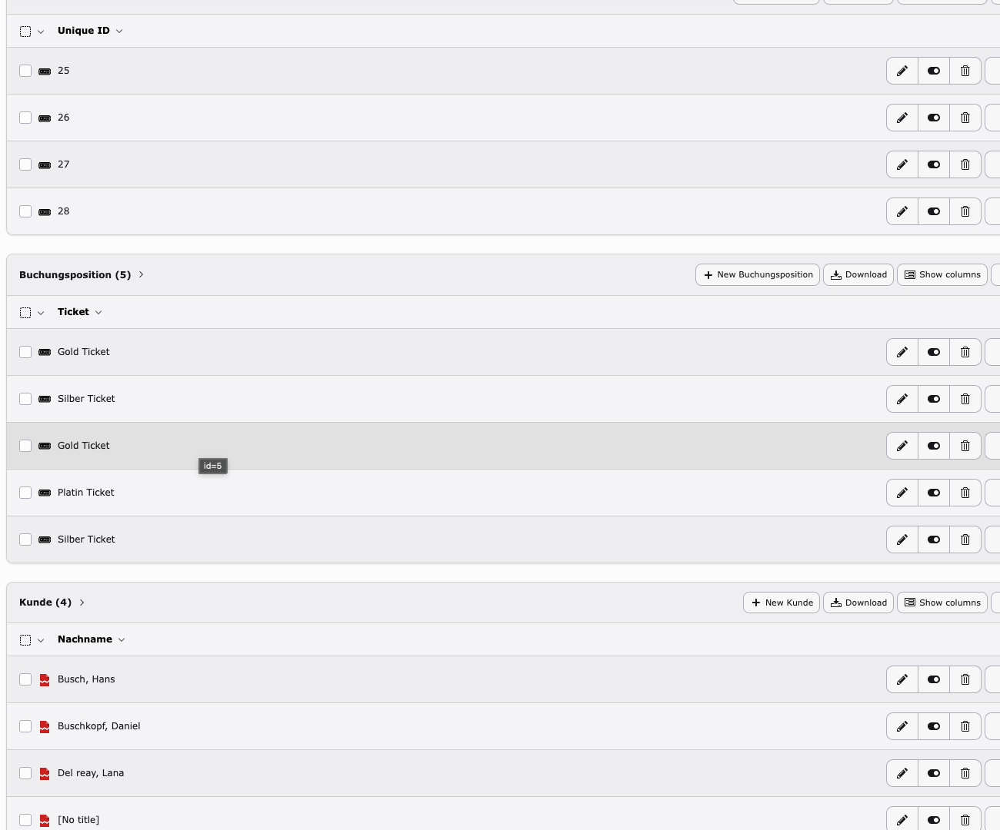

# event-ticket-system
Modern TYPO3 event management system with ticket booking and participant administration.
<p align="center">
  
</p>

<h1 align="center">🎫 Event Ticket System</h1>

<p align="center">
Modern TYPO3 Event Management System for organizations, schools and businesses.
</p>

<p align="center">


</p>

---

# 📖 Overview

Event Ticket System is a custom TYPO3 extension that enables organizations to manage events, tickets and registrations within one centralized application.

Instead of spreadsheets, emails or WhatsApp groups, all event information is managed inside one modern backend.

---

# ✨ Features

- 🎫 Event Management
- 👥 Participant Management
- 🎟 Ticket Types
- 📧 Registration System
- 📊 Booking Overview
- ⚡ Fast TYPO3 Backend
- 📱 Responsive Frontend
- 🔒 Secure Database Storage

---

# Screenshots

## Event Overview



## Booking



## Backend Ticket Management



## TYPO3 Record Management



---

# ⚙ Tech Stack

- TYPO3 v13
- PHP 8
- MySQL
- HTML5
- CSS / SCSS
- JavaScript
- Fluid Templates

---

# 🏗 Project Structure

```
Classes/
Configuration/
Resources/
├── Private/
├── Public/
```

---

# 🚀 Installation

Clone the repository

```bash
git clone https://github.com/fawozane/event-ticket-system.git
```

Install dependencies

```bash
composer install
```

Activate the extension in TYPO3.

---

# 💡 Planned Features

- QR Code Tickets
- Email Notifications
- Event Categories
- Calendar View
- Export Bookings (CSV)
- Ticket Validation
- Dashboard Analytics

---

# 🎯 Use Cases

Perfect for:

- Schools
- Churches
- Clubs
- Associations
- Conferences
- Workshops
- Small Businesses

---

# 👨‍💻 Author

**Fawozane Ouro-Djobo**

Founder of Oklahoma Solutions

🌐 https://oklahomasolutions.de

GitHub

https://github.com/fawozane

LinkedIn

https://linkedin.com/in/fawozane-ouro-djobo

---

# 📄 License

This project is licensed under the MIT License.
